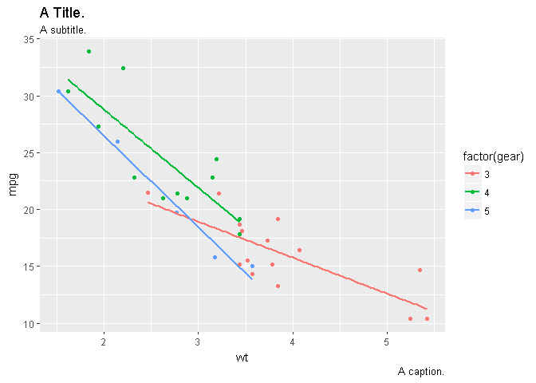
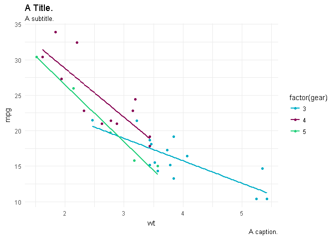
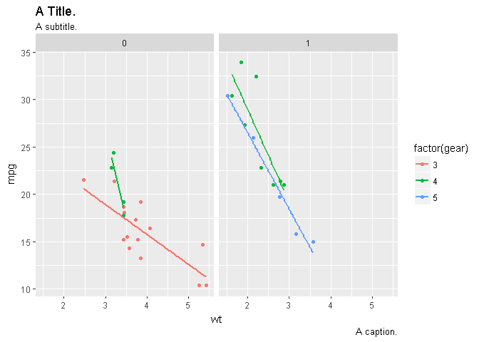
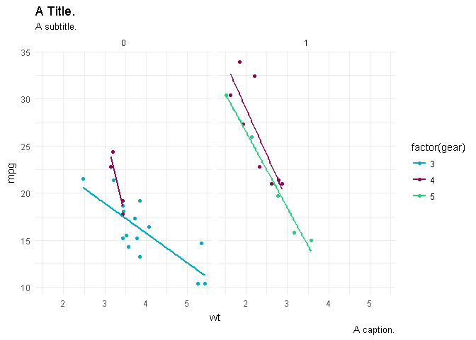
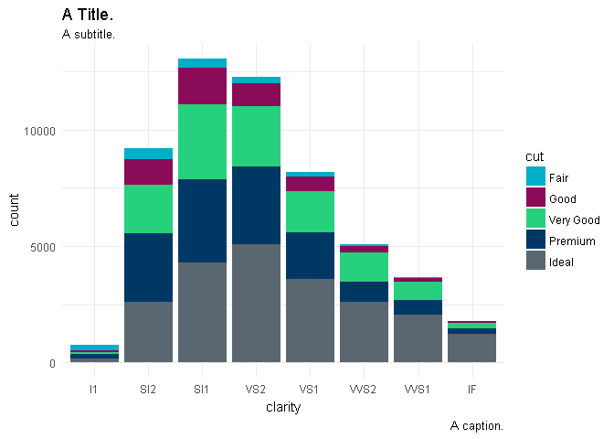
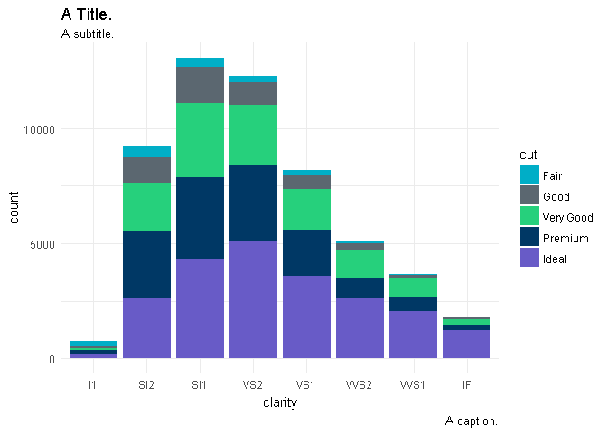

<!-- README.md is generated from README.Rmd. Please edit that file -->
Introduction
============

The goal of this package is to make integrating the ERCOT colors easily with `ggplot2` plots.

Installation
------------

You can install this package from GitHubs by calling `devtools::install_github("aelhabr/ercotr")`.

Examples
--------

``` r
library("ggplot2")
#> Warning: package 'ggplot2' was built under R version 3.4.3
library("ercotr")

viz_labs <-
    labs(title = "A Title.",
       subtitle = "A subtitle.",
       caption = "A caption.")


viz_cars <-
  ggplot(mtcars, aes(x = wt, y = mpg, color = factor(gear))) +
  geom_point() +
  geom_smooth(method = "lm", se = FALSE) +
  viz_labs

viz_cars_facet <-
  viz_cars +
  facet_wrap(~ am)

viz_diamonds <-
  ggplot(diamonds, aes(x = clarity, fill = cut)) +
  geom_bar() +
  viz_labs

viz_cars + theme_grey()
```



``` r
viz_cars + scale_color_ercot() + theme_minimal()
```



``` r

viz_cars_facet + theme_grey()
```



``` r
viz_cars_facet + scale_color_ercot() + theme_minimal()
```



``` r


viz_diamonds + scale_fill_ercot() + theme_minimal()
```



``` r
viz_diamonds + scale_fill_ercot2() + theme_minimal()
```


